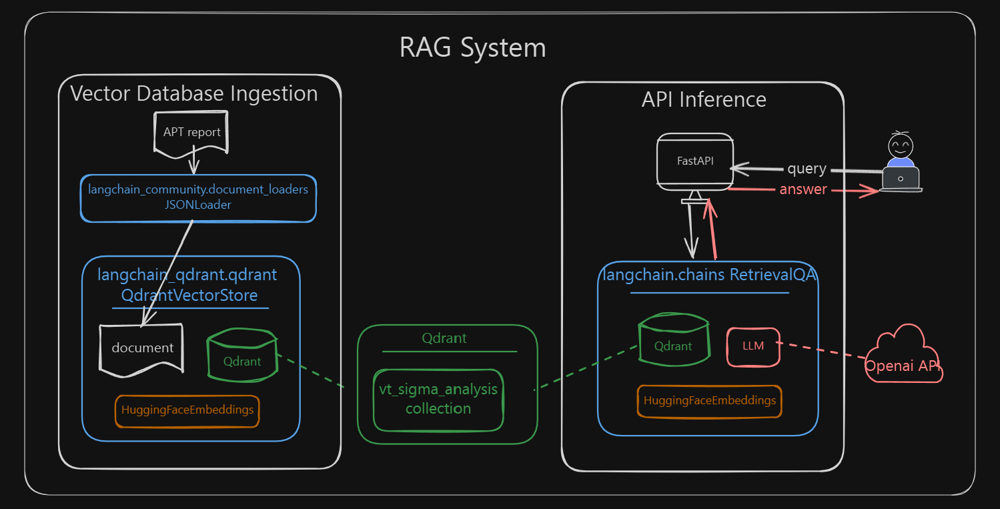
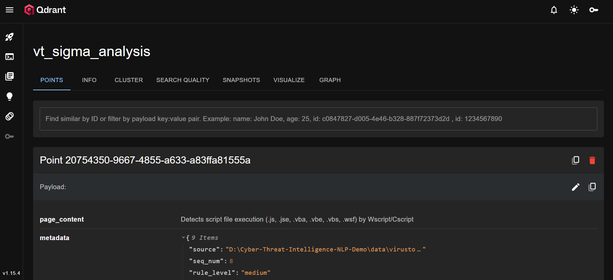
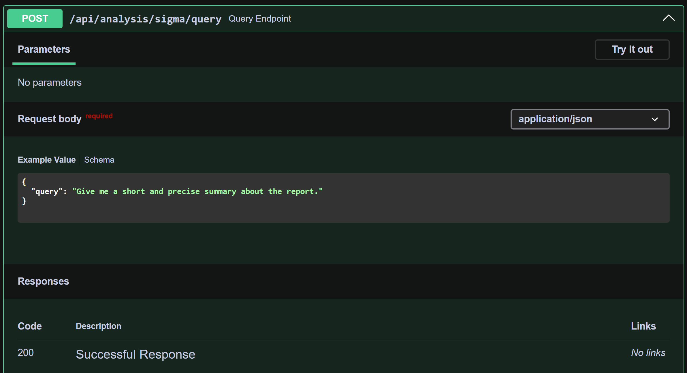
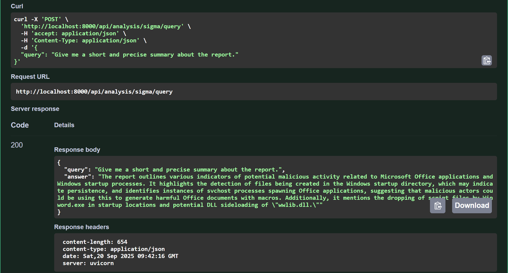

# 🛡️ Cyber Threat Intelligence NLP Demo  
**APT Report Information Extraction & Semantic Retrieval (POC)**  

## 📌 Overview  
This project demonstrates how to use **NLP + LLM + Vector Databases** to automatically extract and retrieve **threat intelligence (Indicators of Compromise, IOCs)** from Advanced Persistent Threat (APT) reports.  
It provides a **natural language Q&A interface** to help security analysts quickly access key findings from reports.  

## 🏗️ Architecture  

```text
[APT Reports] → [Preprocessing] → [HF Transformer Embeddings]
     → [Vector DB: Qdrant] → [LangChain RAG Pipeline]
     → [FastAPI] → [User Query & Threat Intel Retrieval]
```
## 🎯 Features  
This project's workflow is divided into two main parts: Vector Database Ingestion and API Inference.

### 1. Vector Database Ingestion
This stage focuses on processing raw threat intelligence reports into a format suitable for retrieval.

- **APT Report Parsing**: 
The **langchain_community.document_loaders.JSONLoader** is used to parse JSON-based cyber threat reports. It extracts key metadata from the **sigma_analysis_results** field, such as rule level, source, title, and description.

- **Vectorization**: The extracted text information is converted into high-dimensional vectors using **HuggingFace Embeddings**, a crucial step for enabling semantic search.

- **Data Persistence**: The processed vectors and metadata are stored in the **Qdrant** vector database, creating a searchable knowledge base.

### 2. API Inference
This stage handles user queries and generates responses in real time.

- **Semantic Retrieval**: Using **langchain_qdrant.qdrant.QdrantVectorStore**, the system performs a semantic search to find the most relevant threat intelligence information related to a user's query.

- **RAG Pipeline**: The **LangChain RetrievalQA** pipeline combines the retrieved information with the user's query and sends it to a Large Language Model (LLM) to generate a precise, natural language answer.

- **FastAPI Interface**: A **FastAPI** service provides the user interface for the RAG system, allowing for natural language Q&A.


## 📋 Data Sources

This project leverages publicly available cyber threat intelligence reports to demonstrate information extraction and analysis. The core dataset and Indicators of Compromise (IOCs) used in this demo are derived from a detailed report by **Netskope**, focusing on a specific threat campaign.

Specifically, the analyzed data originates from the following report:

* **"A look at the Nim-based campaign using Microsoft Word docs to impersonate the Nepali government"** from [Netskope Threat Labs](https://www.netskope.com/blog/a-look-at-the-nim-based-campaign-using-microsoft-word-docs-to-impersonate-the-nepali-government)

This approach ensures the project's practicality and relevance by processing real-world, non-offensive threat intelligence for educational and research purposes.

## 🔧 Tech Stack
```
Models: HuggingFace Transformers (embeddings)
Pipeline: LangChain (RAG, RetrievalQA)
Vector Database: Qdrant
Infrastructure: Docker, Pipenv
API / UI: FastAPI
```

## 📂 Project Structure
```
cyber-threat-intel-nlp/
│── data/                # APT reports (json)
│── notebooks/           # Prototypes & EDA
│── src/
│   ├── api/             # FastAPI demo services
│   ├── ingestion/       # Data loaders
│   ├── models/          # HuggingFace models
│   ├── retrieval/       # LangChain + VectorDB pipeline
│── Dockerfile           
│── docker-compose.yml
│── Pipfile              
│── requirements.txt
│── README.md
```


## 🚀 Getting Started
To get the project up and running, follow these steps:
0. **Prepare .env**: First, create a new file named .env in your project's root directory. Copy the contents from .env_sample into .env and fill in the required values for your API keys and service addresses.
1. **Export Dependencies**: Export your Pipenv dependencies to a requirements.txt file. This ensures your Docker build uses the correct package versions.
     ```
     pipenv install
     pipenv shell
     python -um demo ingest_collection
     ```
2. **Build & Run with Docker**: Build the Docker images and start the containers defined in your docker-compose.yml file. This will launch all the services you need.
     ```
     docker-compose up --build
     ```
3. **Access Services**: Once the containers are running, you can access the various services at the following URLs:
     - Jupyter Notebook: http://localhost:8888
     - Qdrant Dashboard: http://localhost:6333/dashboard
          
     - FastAPI Docs: http://localhost:8000/docs
          - curl e.g. 
               ```
               curl -X 'POST' \
               'http://localhost:8000/api/analysis/sigma/query' \
               -H 'accept: application/json' \
               -H 'Content-Type: application/json' \
               -d '{
               "query": "Give me a short and precise summary about the report."
               }'
               ```
          
          

## 💡 Roadmap
```
 Add automatic MITRE ATT&CK technique mapping
 Expand multilingual support (EN / ZH / JA)
 Build threat graph for entity linking
 Integrate with open CTI feeds
```

## 📜 Disclaimer
```
This project is for research and educational purposes only.
Data sources are publicly available APT reports.
It is not intended for offensive use or penetration testing.
```
